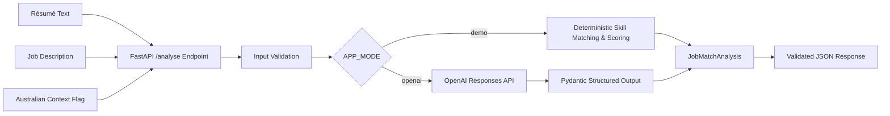

# AI Job Match Agent

A production-style FastAPI application that compares a candidate's résumé with a job description and returns a structured, evidence-based job-match analysis.

The project demonstrates practical Generative AI integration, API design, validation, deterministic fallback logic, automated testing, error handling, and responsible-AI principles.

## Why I Built This

Job seekers often know they have relevant experience but struggle to identify which requirements they already meet, where the gaps are, and how to tailor an application without exaggerating their background.

This project turns that problem into a structured workflow:

1. Accept résumé text and a job description.
2. Validate the input before analysis.
3. Analyse skills and requirements using either deterministic demo logic or an OpenAI model.
4. Return a predictable structured response with matched, partial, and missing skills.
5. Recommend truthful actions the candidate can take to strengthen an application.

## Key Features

- **FastAPI REST API** with automatically generated Swagger documentation.
- **Two analysis modes:** deterministic `demo` mode and OpenAI-powered `openai` mode.
- **Structured LLM output** parsed directly into Pydantic models.
- **Evidence-based skill analysis** with matched, partial, and missing requirements.
- **Transparent scoring** in demo mode rather than an unexplained black-box score.
- **Input validation** for minimum content length, duplicate documents, and maximum request size.
- **Safe error handling** for authentication, API connectivity, validation, and service failures.
- **Automated API tests** using FastAPI's `TestClient` and `pytest`.
- **Environment-based configuration** so API keys stay outside the source code.
- **Australian employment context** can be included in the analysis.
- **Responsible-AI guardrail:** the analysis is instructed not to invent skills, employment, qualifications, achievements, or experience.

## Architecture



## Tech Stack

| Area | Technology |
|---|---|
| Language | Python |
| API framework | FastAPI |
| Data validation | Pydantic |
| Configuration | pydantic-settings, python-dotenv |
| Generative AI | OpenAI API |
| HTTP/client support | HTTPX |
| Testing | pytest, FastAPI TestClient |
| API server | Uvicorn |
| Version control | Git / GitHub |

## Project Structure

```text
job-match-agent/
├── app/
│   ├── __init__.py
│   ├── agent.py       # Analysis logic, demo mode and OpenAI integration
│   ├── config.py      # Environment-based application settings
│   ├── main.py        # FastAPI application and API endpoints
│   └── schemas.py     # Pydantic request/response models
├── tests/
│   ├── __init__.py
│   └── test_api.py    # API and validation tests
├── .env.example       # Safe configuration template
├── .gitignore
├── requirements.txt
└── README.md
```

## API Endpoints

| Method | Endpoint | Purpose |
|---|---|---|
| `GET` | `/` | API information and active mode |
| `GET` | `/health` | Health check |
| `POST` | `/analyse` | Compare résumé text with a job description |
| `GET` | `/docs` | Interactive Swagger/OpenAPI documentation |

## Response Structure

The `/analyse` endpoint returns a validated `JobMatchAnalysis` object containing:

- `overall_score`
- `score_explanation`
- `summary`
- `matched_skills`
- `partial_skills`
- `missing_skills`
- `recommended_actions`
- `information_to_confirm`
- `australian_market_notes`
- `honesty_statement`

Each skill assessment includes the skill, match status, supporting evidence, and a recommended action.

## Demo Mode vs OpenAI Mode

### Demo mode

`APP_MODE=demo`

Demo mode does not call an external AI service. It performs deterministic skill extraction, keyword matching, repeated-term analysis, and transparent scoring. This makes the application free to run and reliable for automated testing.

### OpenAI mode

`APP_MODE=openai`

OpenAI mode sends the résumé and job description to the configured model and uses structured parsing so the model response must conform to the `JobMatchAnalysis` Pydantic schema.

The default model in `.env.example` is `gpt-4.1-mini`, and it can be changed through an environment variable without modifying application code.

## Run Locally

### 1. Clone the repository

```bash
git clone https://github.com/Santo250499/job-match-agent.git
cd job-match-agent
```

### 2. Create a virtual environment

**Windows PowerShell**

```powershell
python -m venv .venv
.\.venv\Scripts\Activate.ps1
```

**macOS / Linux**

```bash
python3 -m venv .venv
source .venv/bin/activate
```

### 3. Install dependencies

```bash
pip install -r requirements.txt
```

### 4. Create local configuration

**Windows PowerShell**

```powershell
Copy-Item .env.example .env
```

**macOS / Linux**

```bash
cp .env.example .env
```

The project runs in demo mode by default, so an API key is not required.

To use OpenAI mode, update your private `.env` file:

```env
APP_MODE=openai
OPENAI_API_KEY=your_private_api_key_here
OPENAI_MODEL=gpt-4.1-mini
```

Never commit the real `.env` file or API key to GitHub.

### 5. Start the API

```bash
uvicorn app.main:app --reload
```

Open the interactive API documentation at:

```text
http://127.0.0.1:8000/docs
```

## Example Request

```json
{
  "resume_text": "Python developer with FastAPI, Git, automation and customer support experience...",
  "job_description": "We are looking for a candidate with Python, FastAPI, GitHub, Azure and Power BI experience...",
  "australian_context": true
}
```

## Example Response Shape

```json
{
  "overall_score": 78,
  "score_explanation": "The résumé demonstrates several directly relevant skills while some preferred requirements need stronger evidence.",
  "summary": "The candidate shows a solid technical match with opportunities to strengthen several job-specific requirements.",
  "matched_skills": [],
  "partial_skills": [],
  "missing_skills": [],
  "recommended_actions": [],
  "information_to_confirm": [],
  "australian_market_notes": [],
  "honesty_statement": "This analysis must not invent employment, qualifications, skills, achievements or experience."
}
```

> The example above illustrates the response schema. Actual analysis depends on the submitted résumé, job description, and selected application mode.

## Testing

Run the automated test suite with:

```bash
pytest -q
```

The current test suite verifies:

- the root endpoint responds correctly;
- the health endpoint reports a valid application mode;
- analysis returns the required structured fields;
- résumés that are too short are rejected;
- identical résumé and job-description inputs are rejected; and
- missing required fields are rejected.

## Validation and Reliability

The API includes multiple safeguards before and during analysis:

- résumé and job-description text must each contain meaningful content;
- combined input size is limited by configuration;
- identical documents are rejected;
- AI output must match the Pydantic response schema;
- authentication and connectivity errors are converted into safe application-level messages; and
- unexpected internal errors are not exposed directly to API users.

## Responsible AI & Privacy Considerations

This project was designed as a decision-support tool, not an automated hiring decision-maker.

Key principles:

- **No fabricated experience:** recommendations should only use skills and achievements the candidate can truthfully support.
- **Human review remains essential:** an AI-generated match score should not decide whether a person is suitable for employment.
- **Structured output improves reliability:** Pydantic validation reduces unpredictable response formats.
- **API keys stay private:** secrets are configured through environment variables and are not stored in source code.
- **Sensitive information should be minimised:** users should avoid submitting unnecessary personal or confidential information to external AI services.
- **Scores are guidance, not fact:** job suitability includes context and human judgement that cannot be represented by one numeric score.

## What This Project Demonstrates

This repository is part of my practical AI and automation portfolio. It demonstrates my ability to:

- translate a real user problem into a software workflow;
- build and document a REST API with FastAPI;
- integrate a Generative AI model with an application;
- use structured outputs instead of relying on free-form LLM text;
- design validation and safe error handling;
- separate secrets and configuration from source code;
- write automated tests for API behaviour; and
- think about responsible AI, privacy, and human oversight.

## Roadmap

Potential future improvements include:

- web-based user interface;
- PDF/DOCX résumé parsing;
- authentication and user accounts;
- configurable job-skill taxonomies;
- database-backed analysis history;
- evaluation datasets for comparing scoring quality;
- CI/CD with GitHub Actions;
- containerisation with Docker;
- cloud deployment;
- observability and secure production logging; and
- additional model/provider support.

## Author

**Md Tanvir Mannan**  
ICT Support & AI Automation Professional  
GitHub: [Santo250499](https://github.com/Santo250499)

---

This project is intended for learning, portfolio demonstration, and decision support. It is not a substitute for professional recruitment judgement and should not be used as the sole basis for employment decisions.
